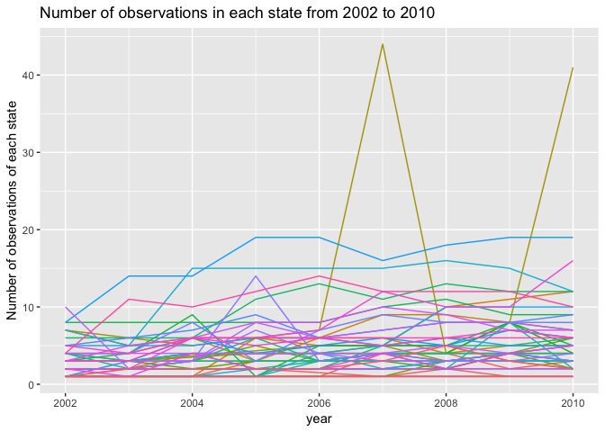
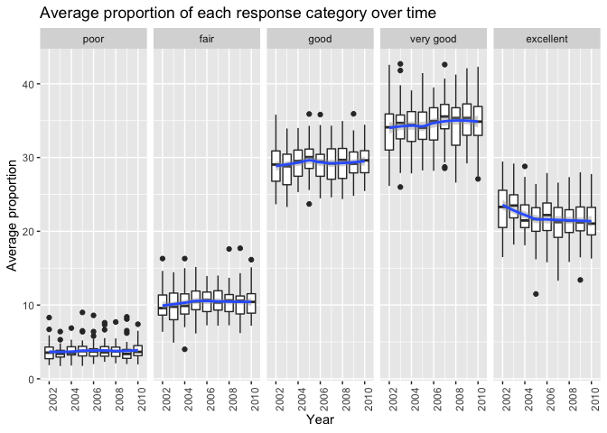
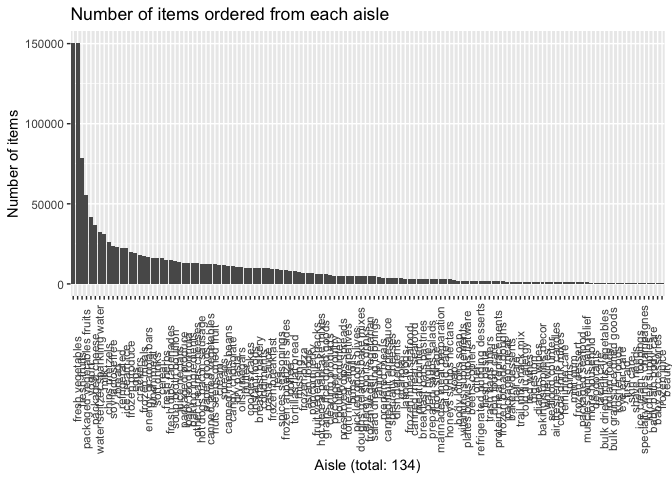
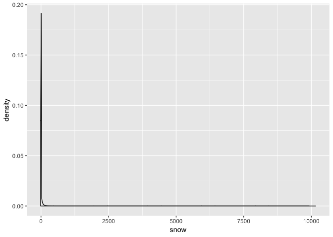
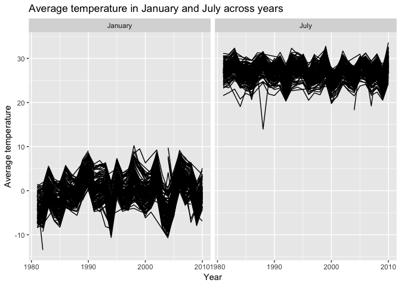
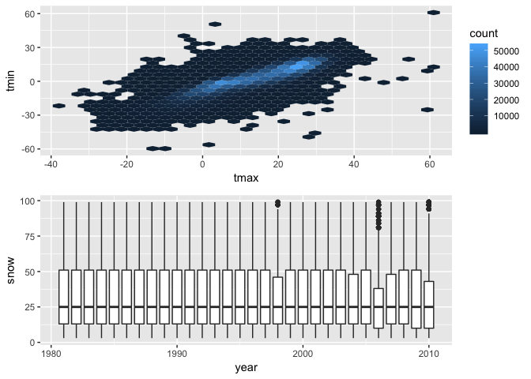

p8105\_homework3\_lz2586
================
Lyuou Zhang
10/7/2018

## Problem 1

#### Data import, cleaning and exploration

``` r
# This part focuses on data import and data cleaning
# Import BRFSS data (built in in the p8105 data package), data cleaning and formating
brfss <- brfss_smart2010 %>% 
  janitor::clean_names() %>% 
  rename(state = 'locationabbr', county = 'locationdesc') %>% 
  filter(topic == 'Overall Health') %>% 
  select(-(class:question), -sample_size, -(confidence_limit_low:geo_location)) %>% 
  mutate(response = tolower(response))
# I put the BRFSS data in a data frame called "brfss", cleaned the names and renamed the variable "locationabbr" to "state", and "locationdesc" to "county", filtered the topic and only kept "overall health", selected the variables, and turned the responses to lower case.

# Now "response" is a character variable. I will convert it ("excellent" to "poor") to an ordered factor variable.
brfss$response <- factor(brfss$response, levels = c('poor', 'fair', 'good', 'very good', 'excellent'), ordered = TRUE)
```

  - I put the BRFSS data in a data frame called “brfss”, cleaned the
    names and renamed the variable “locationabbr” to “state”, and
    “locationdesc” to “county”, filtered the topic and only kept
    “overall health”, selected the variables, and turned the responses
    to lower case.  
  - I also used factor() to convert the response, which was a character
    variable, to an ordered factor variable.

#### \* In 2002, which states were observed at 7 locations?

``` r
# Part 2 focuses on visualization and answering the questions
# For this part, I need an untidy version of BRFSS to answer some of the questions, so I created "brfss_untidy"
brfss_untidy <- spread(brfss, key = response, value = data_value)

# I created a data frame which counts the number of locations of each state called "location_num"
location_num_2002 <- 
  brfss_untidy %>% 
  filter(year == '2002') %>% 
  group_by(state) %>% 
  summarize(n_location = n())
# Use filter to find the state where 7 locations were observed
filter(location_num_2002, n_location == 7)
```

    ## # A tibble: 3 x 2
    ##   state n_location
    ##   <chr>      <int>
    ## 1 CT             7
    ## 2 FL             7
    ## 3 NC             7

``` r
# Connecticut, Florida and North Carolina have 7 locations observed
```

  - In 2002, **Connecticut**, **Florida** and **North Carolina** have 7
    locations
observed.

#### Make a “spaghetti plot” that shows the number of observations in each state from 2002 to 2010.

``` r
# Create a data frame that counts the number of observations of each state by year, and use ggplot + geom_line
location_num <- 
  brfss_untidy %>% 
  group_by(year, state) %>% 
  summarize(n_location = n())

ggplot(location_num, aes(x = year, y = n_location, color = state)) + 
  geom_line() + 
  labs(title = 'Number of observations in each state from 2002 to 2010',
       y = 'Number of observations of each state'
       ) +
  theme(legend.position = "none")
```

<!-- -->

``` r
ggsave('spaghetti_plot.jpeg') 
```

    ## Saving 7 x 5 in image

#### Make a table showing, for the years 2002, 2006, and 2010, the mean and standard deviation of the proportion of “Excellent” responses across locations in NY State.

``` r
# filter the years from the brfss_untidy data frame and group_by by year and state, and summarize by mean and sd and knit a table
brfss_untidy %>% 
  filter(year == '2002' | year == '2006' | year == '2010') %>% 
  filter(state == 'NY') %>% 
  group_by(year, state) %>% 
  summarize(excellent_mean = mean(excellent, na.rm = T),
            excellent_sd = sd(excellent, na.rm = T)) %>% 
  knitr::kable()
```

| year | state | excellent\_mean | excellent\_sd |
| ---: | :---- | --------------: | ------------: |
| 2002 | NY    |        24.04000 |      4.486424 |
| 2006 | NY    |        22.53333 |      4.000833 |
| 2010 | NY    |        22.70000 |      3.567212 |

#### For each year and state, compute the average proportion in each response category (taking the average across locations in a state). Make a five-panel plot that shows, for each response category separately, the distribution of these state-level averages over time.

plot the average proportion in each response category (poor\_p to
excellent\_p), and organize them in panels. For each plot, I use the
brfss\_untidy data and group by year and state, summarize by mean and
use ggplot + geom\_line

``` r
brfss %>% 
  group_by(year, state, response) %>% 
  summarize(avg_prop = mean(data_value)) %>% 
  ggplot(aes(x = year, y = avg_prop)) + 
  geom_boxplot(aes(group = year)) +
  geom_smooth() +
  facet_grid(~response) +
  labs(title = 'Average proportion of each response category over time',
      y = 'Average proportion',
      x = 'Year'
) +
  theme(axis.text.x = element_text(angle = 90))
```

    ## Warning: Removed 21 rows containing non-finite values (stat_boxplot).

    ## `geom_smooth()` using method = 'loess' and formula 'y ~ x'

    ## Warning: Removed 21 rows containing non-finite values (stat_smooth).

<!-- -->

## Problem 2

#### Data cleaning

``` r
data(instacart)
# To turn the variable "reordered" to a logical variable
instacart$reorderd <- as.logical(instacart$reordered)
# To remove the variable "eval_set" because it's the same for every observation
instacart <- 
  instacart %>% 
  select(-eval_set)
# Size of the data
dim(instacart)
```

    ## [1] 1384617      15

#### How many aisles are there, and which aisles are the most items ordered from?

``` r
aisle <- 
instacart %>% 
  group_by(aisle) %>% 
  summarize(n_aisle = n()) %>% 
  arrange(desc(n_aisle))
# The top 5 aisles that the most items are ordered from are fresh vegetables (1), fresh fruits (2), packaged vegetables fruits (3), yogurt (4), packaged cheese(5).

dim(aisle)
```

    ## [1] 134   2

``` r
# there are 134 rows (134 aisles)
```

  - There are 134 rows. The top 5 aisles that the most items are ordered
    from are fresh vegetables (No.1), fresh fruits (No.2), packaged
    vegetables fruits (No.3), yogurt (No.4), packaged
cheese(No.5).

#### Make a plot that shows the number of items ordered in each aisle. Order aisles sensibly, and organize your plot so others can read it.

``` r
aisle %>% 
  ggplot(aes(x = reorder(aisle, -n_aisle), y = n_aisle)) +
  geom_bar(stat = 'identity') +
  labs(
    title = 'Number of items ordered from each aisle',
    x = 'Aisle (total: 134)',
    y = 'Number of items'
  ) +
  theme(axis.text.x = element_text(angle = 90))
```

<!-- -->

#### Make a table showing the most popular item aisles “baking ingredients”, “dog food care”, and “packaged vegetables fruits”

``` r
# filter the aisles, group them, summarize the counts, show the top 1 item and knit
instacart %>% 
  filter(aisle == 'baking ingredients' | aisle == 'dog food care' | aisle == 'packaged vegetables fruits') %>% 
  group_by(aisle, product_name) %>% 
  summarize(n = n()) %>% 
  top_n(1) %>%  
  knitr::kable()
```

    ## Selecting by n

| aisle                      | product\_name                                 |    n |
| :------------------------- | :-------------------------------------------- | ---: |
| baking ingredients         | Light Brown Sugar                             |  499 |
| dog food care              | Snack Sticks Chicken & Rice Recipe Dog Treats |   30 |
| packaged vegetables fruits | Organic Baby Spinach                          | 9784 |

#### Make a table showing the mean hour of the day at which Pink Lady Apples and Coffee Ice Cream are ordered on each day of the week; format this table for human readers (i.e. produce a 2 x 7 table)

``` r
instacart %>% 
  filter(product_name == 'Pink Lady Apples' | product_name == 'Coffee Ice Cream') %>% 
  group_by(product_name, order_dow) %>% 
  summarize(mean_hod = mean(order_hour_of_day)) %>% 
  spread(key = product_name, value = mean_hod) %>% 
  knitr::kable()
```

| order\_dow | Coffee Ice Cream | Pink Lady Apples |
| ---------: | ---------------: | ---------------: |
|          0 |         13.77419 |         13.44118 |
|          1 |         14.31579 |         11.36000 |
|          2 |         15.38095 |         11.70213 |
|          3 |         15.31818 |         14.25000 |
|          4 |         15.21739 |         11.55172 |
|          5 |         12.26316 |         12.78431 |
|          6 |         13.83333 |         11.93750 |

## Problem 3

#### Data cleaning

``` r
noaa <- ny_noaa
# Dimension of the dataset
dim(noaa)
```

    ## [1] 2595176       7

``` r
# 2595176 rows and 7 columns
# Take a look at the summary of the data, which will tell me the variable types, the number of missing values and summary statistics
summary(noaa)
```

    ##       id                 date                 prcp         
    ##  Length:2595176     Min.   :1981-01-01   Min.   :    0.00  
    ##  Class :character   1st Qu.:1988-11-29   1st Qu.:    0.00  
    ##  Mode  :character   Median :1997-01-21   Median :    0.00  
    ##                     Mean   :1997-01-01   Mean   :   29.82  
    ##                     3rd Qu.:2005-09-01   3rd Qu.:   23.00  
    ##                     Max.   :2010-12-31   Max.   :22860.00  
    ##                                          NA's   :145838    
    ##       snow             snwd            tmax               tmin          
    ##  Min.   :  -13    Min.   :   0.0   Length:2595176     Length:2595176    
    ##  1st Qu.:    0    1st Qu.:   0.0   Class :character   Class :character  
    ##  Median :    0    Median :   0.0   Mode  :character   Mode  :character  
    ##  Mean   :    5    Mean   :  37.3                                        
    ##  3rd Qu.:    0    3rd Qu.:   0.0                                        
    ##  Max.   :10160    Max.   :9195.0                                        
    ##  NA's   :381221   NA's   :591786

``` r
# convert tmax and tmin to numeric variables
noaa$tmax <- as.integer(noaa$tmax)
noaa$tmin <- as.integer(noaa$tmin)
# further look at the summary statistics 
skimr::skim(noaa)
```

    ## Skim summary statistics
    ##  n obs: 2595176 
    ##  n variables: 7 
    ## 
    ## ── Variable type:character ──────────────────────────────────────────────────────────────────
    ##  variable missing complete       n min max empty n_unique
    ##        id       0  2595176 2595176  11  11     0      747
    ## 
    ## ── Variable type:Date ───────────────────────────────────────────────────────────────────────
    ##  variable missing complete       n        min        max     median
    ##      date       0  2595176 2595176 1981-01-01 2010-12-31 1997-01-21
    ##  n_unique
    ##     10957
    ## 
    ## ── Variable type:integer ────────────────────────────────────────────────────────────────────
    ##  variable missing complete       n   mean     sd   p0 p25 p50 p75  p100
    ##      prcp  145838  2449338 2595176  29.82  78.18    0   0   0  23 22860
    ##      snow  381221  2213955 2595176   4.99  27.22  -13   0   0   0 10160
    ##      snwd  591786  2003390 2595176  37.31 113.54    0   0   0   0  9195
    ##      tmax 1134358  1460818 2595176 139.8  111.42 -389  50 150 233   600
    ##      tmin 1134420  1460756 2595176  30.29 104    -594 -39  33 111   600
    ##      hist
    ##  ▇▁▁▁▁▁▁▁
    ##  ▇▁▁▁▁▁▁▁
    ##  ▇▁▁▁▁▁▁▁
    ##  ▁▁▂▇▇▆▁▁
    ##  ▁▁▁▆▇▂▁▁

``` r
# there are a lot of missing data

# the percentages of missing data of each numeric variable
# overall
mean(is.na(noaa))
```

    ## [1] 0.1864791

``` r
# 18.6% of the data are missing

# for prcp, snow, snwd, tmax and tmin
mean(is.na(noaa$prcp))
```

    ## [1] 0.0561958

``` r
mean(is.na(noaa$snow))
```

    ## [1] 0.146896

``` r
mean(is.na(noaa$snwd))
```

    ## [1] 0.2280331

``` r
mean(is.na(noaa$tmax))
```

    ## [1] 0.4371025

``` r
mean(is.na(noaa$tmin))
```

    ## [1] 0.4371264

``` r
# the percentages of missing values range from 5.6% to 43.7%
```

The NOAA dataset has 7 variables and 2595176 observations. The variables
include the id, date, precipitation, snowfall, snow depth, the maximum
and minimum temperature of the day. There are a lot of missing variables
in this dataset, but the extent to which the missing data becomes an
issue varies between variables. The percentages of missing values in
precipitation, snowfall, snow depth, maximum and minimum temperatures
range from 5.6% (precipitation), which is relatively minor, to 43.7%
(temperatures) which becomes
significant.

#### Do some data cleaning. Create separate variables for year, month, and day. Ensure observations for temperature, precipitation, and snowfall are given in reasonable units. For snowfall, what are the most commonly observed values? Why?

``` r
# use year(), month() and date() to extract year, month and day from date
# also tmin and tmax are not incorrect units. need to divide them by 10.
noaa <- noaa %>% 
  mutate(
    prcp = prcp/10,
    tmin = tmin/10,
    tmax = tmax/10,
    year = year(as.POSIXlt(date, unit = "year")),
    month = month(as.POSIXlt(date, format = '%Y/%m/%d')),
    day = day(as.POSIXlt(date, unit = "day"))
) %>% 
  select(id, year, month, day, everything())

# take a look
head(noaa)
```

    ## # A tibble: 6 x 10
    ##   id           year month   day date        prcp  snow  snwd  tmax  tmin
    ##   <chr>       <dbl> <dbl> <int> <date>     <dbl> <int> <int> <dbl> <dbl>
    ## 1 US1NYAB0001  2007    11     1 2007-11-01    NA    NA    NA    NA    NA
    ## 2 US1NYAB0001  2007    11     2 2007-11-02    NA    NA    NA    NA    NA
    ## 3 US1NYAB0001  2007    11     3 2007-11-03    NA    NA    NA    NA    NA
    ## 4 US1NYAB0001  2007    11     4 2007-11-04    NA    NA    NA    NA    NA
    ## 5 US1NYAB0001  2007    11     5 2007-11-05    NA    NA    NA    NA    NA
    ## 6 US1NYAB0001  2007    11     6 2007-11-06    NA    NA    NA    NA    NA

``` r
# year, month and day are successfully extracted!

# the distribution of snowfall: use a histogram
noaa %>% 
  ggplot(aes(x = snow)) + geom_density()
```

    ## Warning: Removed 381221 rows containing non-finite values (stat_density).

<!-- -->

``` r
# the most common value is 0
```

For this question, I use year(), month() and day() to extract year,
month and day from the “date” variable. From the results under the
head(noaa) command, these variables have been successfully extracted. I
also convert precipitation (1/10 mm), tmax (1/10 C) and tmin (1/10 C) to
the reasonable unit by dividing them by 10.

For snowfall, I use a density plot to see the distribution of snowfall.
The plot shows that the most commonly observed value is **0**. Because
during most time of the year there is no snowfall at
all.

#### Make a two-panel plot showing the average temperature in January and in July in each station across years. Is there any observable / interpretable structure? Any outliers?

``` r
month_name <- c(
  `1` = 'January',
  `7` = 'July'
)

noaa %>% 
  filter(month == '1' | month == '7') %>% 
  group_by(id, year, month) %>%
  summarize(avg_temp_year = mean(tmax, na.rm = T)) %>% 
  ggplot(aes(x = year, y = avg_temp_year, group = id)) +
  geom_line() +
  facet_grid(~month, labeller = as_labeller(month_name)) +
   viridis::scale_color_viridis(
    discrete = TRUE
  ) +
  labs(
    title = 'Average temperature in January and July across years',
    y = 'Average temperature',
    x = 'Year'
  )
```

    ## Warning: Removed 5640 rows containing missing values (geom_path).

<!-- -->

``` r
ggsave('q3_2.jpeg')
```

    ## Saving 7 x 5 in image

    ## Warning: Removed 5640 rows containing missing values (geom_path).

I filter January and July, create a variable called “avg\_temp” for the
daily average temperature, group by id, year and month and calculate the
mean temperature, and use geom\_line to make the plot.

In general, the temperature in January is much lower than July. The
temperatue across stations and years fluctuate but are stable overall.
Compared to July, the variation of temperature between stations is more
significant.

#### Make a two-panel plot showing (i) tmax vs tmin for the full dataset (note that a scatterplot may not be the best option); and (ii) make a plot showing the distribution of snowfall values greater than 0 and less than 100 separately by year

``` r
max_min <- noaa %>% 
  ggplot(aes(x = tmax, y = tmin)) + geom_hex(na.rm = T)

    sf_0_100 <- noaa %>% 
      filter(snow > 0 & snow < 100) %>% 
      ggplot(aes(y = as.factor(year), x = snow)) + geom_density_ridges(na.rm = T)

sf_0_100 <- noaa %>% 
  filter(snow > 0 & snow < 100) %>% 
  ggplot(aes(x = year, y = snow, group = year)) + 
  geom_boxplot()

max_min/sf_0_100
```

<!-- -->

“geom\_hex” shows the relationship between tmax and tmin (max\_min) and
where most points fall in the plot. The relationship seems pretty
linear. As tmax increases, tmin increases too. Most points fall in the
center of the plot and show a linear pattern.

The box plot shows the distribution of snowfall values \>0 and \<100 by
year. The average snowfall seems very stable across years. However the
distribution shows more fluctuation from 2004 ~ 2010.
